# Host Your Private Unity Scoped Registry in Just 15 Minutes

Whether you're a solo developer or part of a team, you've likely encountered the headache of managing reusable codes. Ensuring that your packages are easily accessible, version-controlled, and securely shared within your team is no small feat. A private Unity Package Manager (UPM) registry could be the solution you're looking for.

In this guide, I'll show you how to get your first private UPM registry hosted quickly, using [Verdaccio](https://verdaccio.org/) as the registry server and [DigitalOcean](https://m.do.co/c/50e7f9860fa9) as the cloud provider. Say goodbye to the frustrations of package management and hello to more productive development hours!

## Why Not Use an Existing Registry Provider?

When you start with UPM packages, you might realize that not all registry providers work well with them. If you're eager to see how to set up your registry, feel free to jump to the next section. But if you're curious about the why, here's a quick rundown:

**Package name conventions are different.** UPM packages follow the reverse domain notation and use names like `com.example.my-package`. This is different from what you see on NPMJS or GitHub Registry, where private package names look like `@scope/package-name`. To make these registries work with package names without `@scope/` can be quite hacky.

**Finding packages in Unity needs specific registry features.** For your package to show up in the Unity package manager, the registry needs to understand specific features, like the `/-/all` endpoint or the `/-/v1/search` endpoint. Unfortunately, some big names like GitHub Registry and Azure Artifacts don't support these yet.

That's why we're going to set up our own registry with Verdaccio - a lightweight, easy-to-configure, private npm registry.

## Choosing Your Tools: Verdaccio & DigitalOcean

[Verdaccio](https://verdaccio.org/) stands out as the go-to open-source solution for hosting a private npm registry. It's lightweight, a breeze to configure, and supports a wide array of plugins. OpenUPM has been successfully using a customized version of Verdaccio to host packages, proving its reliability and efficiency. For this guide, we're sticking with version 5, the most stable and mature version to date. We'll consider switching to version 6 once it has proven itself in the field, expected around late-2024.

When it comes to hosting our registry, [DigitalOcean](https://m.do.co/c/50e7f9860fa9) is our platform of choice for OpenUPM. They offer competitive pricing, especially for bandwidth-intensive applications. While the cloud computing market is fiercely competitive, and you're free to choose whichever provider suits you best.

If you don't need to host your registry in the cloud, you can simply run Verdaccio on your local machine or on a server in your local network.

## Prerequisites

Before we dive into the setup, you'll need a DigitalOcean account. Good news! By using this affiliate link: [DigitalOcean](https://m.do.co/c/50e7f9860fa9), you'll snag *$200 in credits valid for 60 days* (new user only). We'll only be using a small portion of these credits for this demo. After the initial 60 days, maintaining your registry should cost as little as $6 per month in most scenarios.

This guide requires little knowledge of managing a Linux server. You can follow the steps easily without any prior experience.

## Setup EasyPanel Droplet

[EasyPanel](https://easypanel.io/) is a modern server panel that simplifies running Docker applications on a Linux server. It offers a web interface for application management, server monitoring, and provides a pre-configured subdomain for application access. We'll use EasyPanel to manage our Verdaccio instance.

Visit the [DigitalOcean Marketplace for EasyPanel](https://marketplace.digitalocean.com/apps/easypanel) and click on the <kbd>Create EasyPanel Droplet</kbd> button. This action will redirect you to the DigitalOcean control panel, where you can set up your droplet (Linux-based virtual machines).

Choose a region close to your team, then scroll to the "Choose Size" section and select a plan that meets your requirements. The $6/month plan (Regular CPU, 1GB memory, 25GB SSD, 1TB transfer) is usually enough for most small teams. However, if you often publish large packages in the hundreds of megabytes, a plan with 2GB memory and a larger SSD disk is advisable.

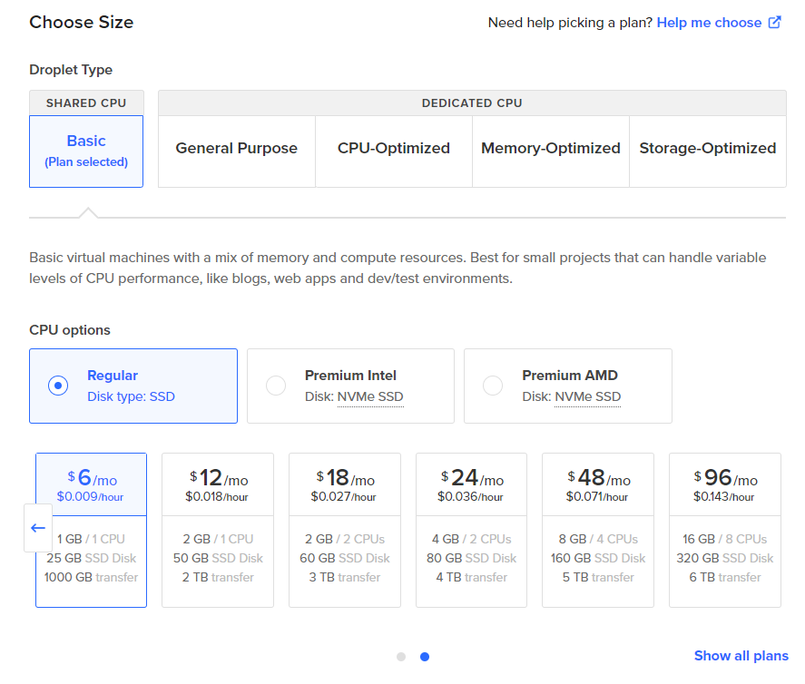

Next, consider the "Backups" option for added droplet durability, which involves enabling daily snapshots at an additional cost of 30% of the droplet price. If you're versed in Linux server management, you could opt for a different backup strategy, such as regularly backing up the Verdaccio folder to S3. Given that the starting price for DigitalOcean's S3 alternative, "Spaces," is $5/month, enabling droplet backups is often a more affordable and simpler solution for most users. The choice is yours.

Choose between SSH Keys or Password for droplet access (opt for a password if you're not familiar with Linux server management). Ensure your key or password is stored securely. Although our demo doesn't require it, you might need it in the future.

To complete the setup, click the <kbd>Create Droplet</kbd> button at the bottom of the page. DigitalOcean may take a minute to prepare your droplet.


Now that our droplet is set up with the IP address `64.23.136.113`, we'll use this IP to access EasyPanel later.

Click on the droplet name to view its details. Then, click the "Networking" tab, scroll down to the "Firewalls" section, and click the <kbd>Edit</kbd> button to add some rules that allow access to the server.

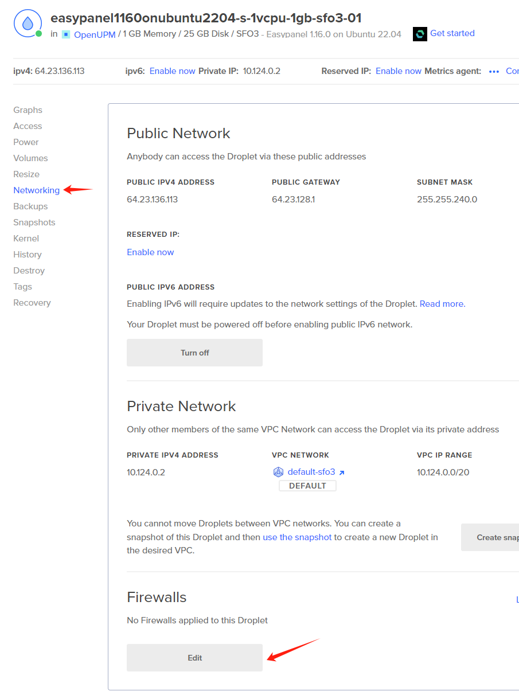

Click the <kbd>Create Firewall</kbd> button, enter a name for the firewall, and add the following rules for inbound traffic:

- Type: SSH
- Type: HTTP
- Type: HTTPS
- Type: Custom, Protocol: TCP, Port: 3000

The last rule is specifically for initial EasyPanel access. It can be removed after the setup is complete.

In the "Apply to Droplets" section, select the droplet you just created and click the <kbd>Create Firewall</kbd> button.

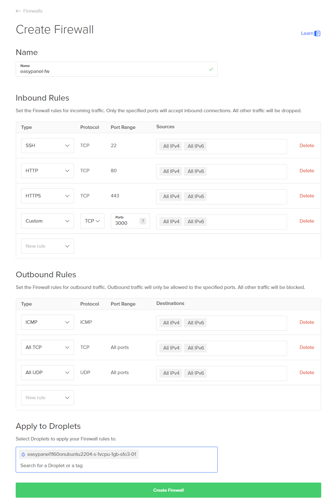

## Access EasyPanel

To access EasyPanel, open a new browser tab and navigate to `http://64.23.136.113:3000/`. Make sure to replace the IP address with your droplet's IP address. Upon visiting, you'll land on the EasyPanel login page. Here, you'll need to sign up by entering your email and a password. The free plan will cover our requirements, but EasyPanel offers a straightforward way to manage your server and applications, so consider upgrading to a paid plan if you find yourself needing additional features.

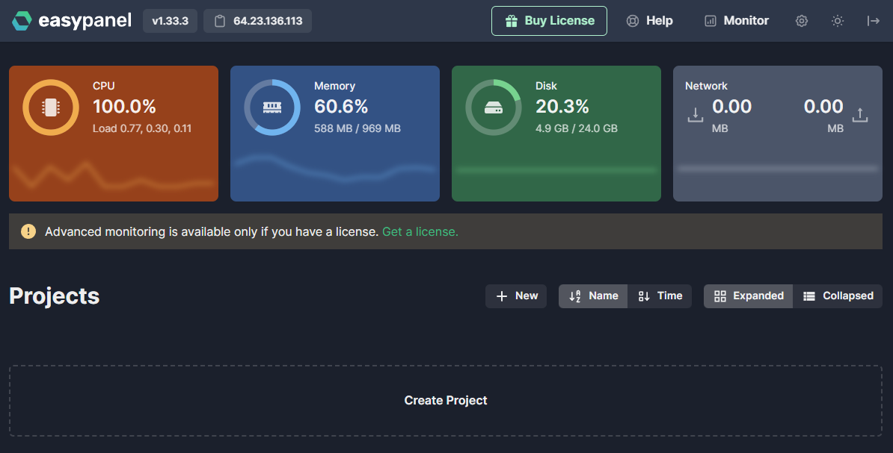

After signing in, click on the Settings icon located in the top right corner, then navigate to the "Default Domain" found under the "General>Panel Domain" section.

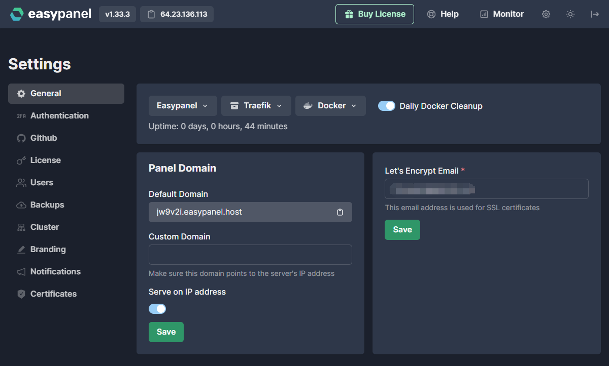

You'll now be able to access EasyPanel through a specific subdomain, such as `https://jw9v2i.easypanel.host/`. Remember to replace `jw9v2i` with the subdomain assigned to you. This subdomain supports HTTPS and is automatically managed by EasyPanel, providing a secure way to access your panel. Once you're set up with your subdomain, the port 3000 rule in the firewall settings is no longer necessary and can be removed for enhanced security.

## Install Verdaccio Server

Open the EasyPanel dashboard and click the <kbd>Create Project</kbd> button. Name your project "upm" and then click on the project name to view its details.

Next, click the <kbd>+ Service</kbd> button and look for "verdaccio" under the "Pick a template" section.

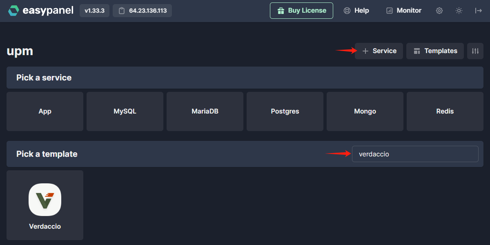

Then, click on the verdaccio icon. Ensure the App Service Image is set to something like `verdaccio/verdaccio:5`, and click the <kbd>Create</kbd> button to proceed.

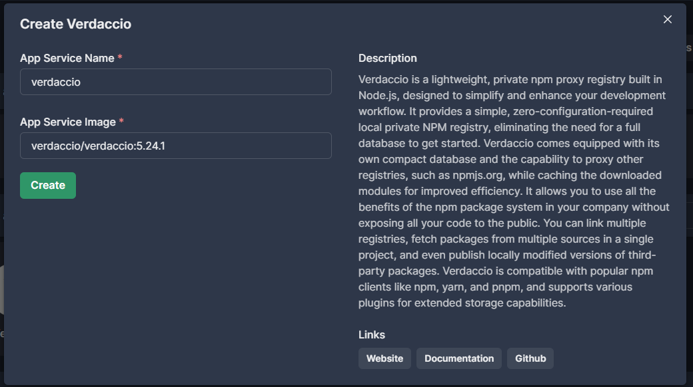

Back on the project details page, you'll notice the Verdaccio service is now being created and will soon be up and running. It's quite a straightforward process!

## Configure Verdaccio Server

The default setup of Verdaccio runs in a container, and its data does not persist during restarts. To address this, we need to configure Verdaccio to use persistent storage for both packages and configuration.

Navigate to the "Storage" tab within your Verdaccio service settings in EasyPanel. Click the <kbd>Add Volume Mount</kbd> button to create a new volume. Name this volume "verdaccio-storage" and set the path to `/verdaccio/storage`.


Next, click the <kbd>Add File Mount</kbd> button to establish a new file mount, setting the path to `/verdaccio/conf/config.yaml`.

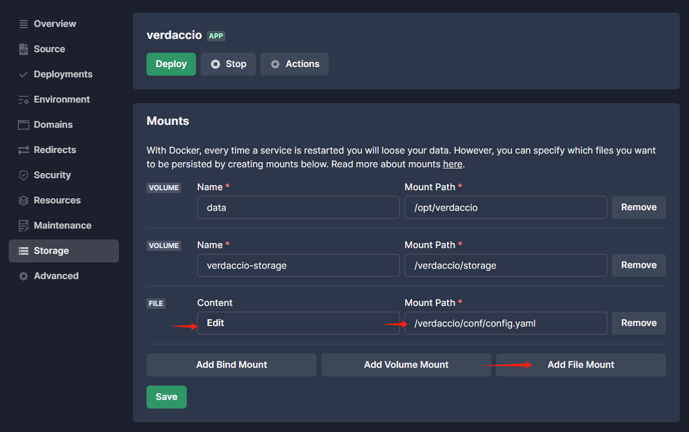

Next, use the <kbd>Edit</kbd> button to input below configuration into the `config.yaml` file.

```yaml
# Do not configure host and port under `listen` in this file
# as it will be ignored when using docker.
# see https://verdaccio.org/docs/en/docker#docker-and-custom-port-configuration
#
# Look here for more config file examples:
# https://github.com/verdaccio/verdaccio/tree/5.x/conf

# path to a directory with all packages
storage: /verdaccio/storage/data

# path to a directory with plugins to include
plugins: /verdaccio/plugins

# https://verdaccio.org/docs/configuration#authentication
auth:
  htpasswd:
    file: /verdaccio/storage/htpasswd
    # Maximum amount of users allowed to register, defaults to "+infinity".
    # You can set this to -1 to disable registration.
    max_users: 1000
    # Hash algorithm, possible options are: "bcrypt", "md5", "sha1", "crypt".
    algorithm: bcrypt

# Learn how to protect your packages
# https://verdaccio.org/docs/protect-your-dependencies/
# https://verdaccio.org/docs/configuration#packages
packages:
  '**':
    # you can specify usernames/groupnames (depending on your auth plugin)
    # and three keywords: "$all", "$anonymous", "$authenticated"

    # allow only authenticated users to access all packages
    access: $authenticated

    # allow only authenticated users to publish/unpublish packages
    publish: $authenticated
    unpublish: $authenticated

# https://verdaccio.org/docs/configuration#server
server:
  keepAliveTimeout: 60

# https://verdaccio.org/docs/configuration#max-body-size
max_body_size: 100mb

middlewares:
  audit:
    enabled: true

# https://verdaccio.org/docs/logger
# log settings
log: { type: stdout, format: pretty, level: http }
```

Verify everything is correct and ensure the "Mount Path" fields are free of any leading or ending spaces. Click the <kbd>Save</kbd> button to finalize your configuration.

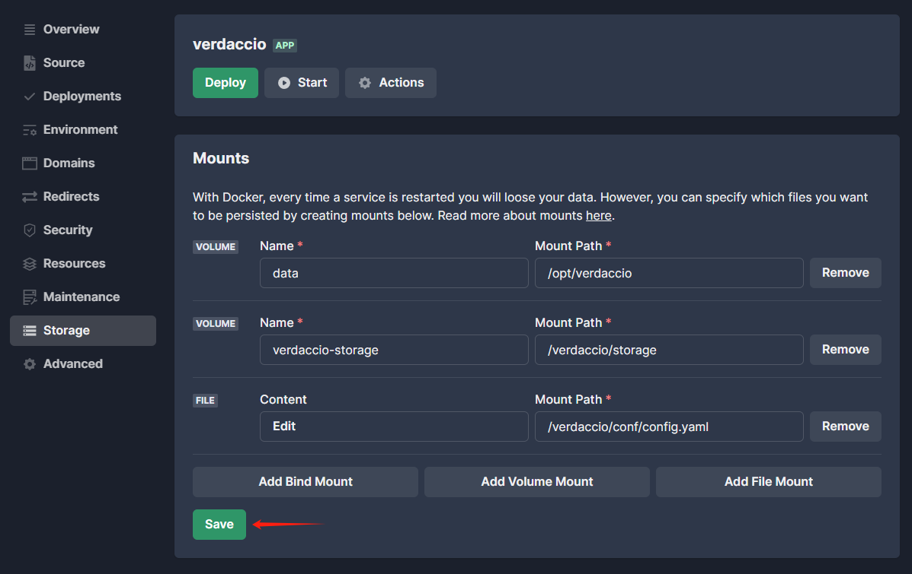

Then, click the <kbd>Deploy</kbd> button to apply the changes. Navigate to the "Deployment" tab, where you'll see a new deployment message listed in the history.


Proceed to the "Domain" tab and note the domain name `https://upm-verdaccio.jw9v2i.easypanel.host/` to access the Verdaccio web interface. This domain is a subdomain of your EasyPanel domain, incorporating both the project name "upm" and the service name "verdaccio." EasyPanel's ability to automatically generate accessible subdomains for services is a key feature that eliminates the need for manual subdomain configuration and reverse proxy setup for service access.

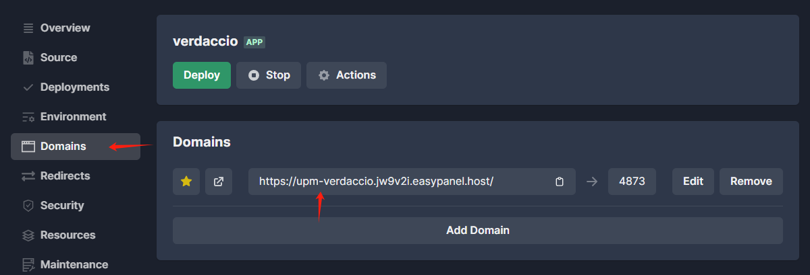

Upon opening the Verdaccio web interface, you'll encounter the login page.


## Create a User Account

To begin using Verdaccio for package management, the first step is to create a user account. Ensure you have [Node.js](https://nodejs.org/en) (LTS suggested) installed on your local machine to execute the necessary commands. This guide will utilize Git-Bash on Windows for demonstration purposes.

Open your terminal and run the following commands to create a new user account on your Verdaccio registry:

```bash
npm adduser --registry https://upm-verdaccio.jw9v2i.easypanel.host/
```

When prompted, enter a username, password, and public email address:

```bash
npm notice Log in on https://upm-verdaccio.jw9v2i.easypanel.host/
Username: upmuser
Password:
Email: (this IS public) upmuser@example.com
Logged in on https://upm-verdaccio.jw9v2i.easypanel.host/.
```

## Publishing an Example Package

To demonstrate how to publish a package, start by creating a folder named `com.example.demo` and navigate into it. Within this folder, create a `package.json` file with the following content:

```json
{
  "name": "com.example.demo",
  "version": "1.0.0",
  "unity": "2020.3",
  "description": "An example demo package",
  "author": "",
  "license": "ISC"
}
```

In practical scenarios, this package folder should be located under your Unity project's `Packages` folder, allowing the Unity editor to generate meta files for the package. Skipping this step will result in a warning from Unity about missing meta files, but for this demo, we'll proceed without it.

Next, publish the package to your Verdaccio registry with the following commands:

```bash
# Navigate to your package directory
cd com.example.demo

# Publish the package
npm publish --registry https://upm-verdaccio.jw9v2i.easypanel.host/
```

Upon successful publication, you'll see an output similar to this:

```bash
npm notice
npm notice �  com.example.demo@1.0.0
npm notice === Tarball Contents ===
npm notice 235B package.json
npm notice === Tarball Details ===
npm notice name:          com.example.demo
npm notice version:       1.0.0
npm notice filename:      com.example.demo-1.0.0.tgz
npm notice package size:  252 B
npm notice unpacked size: 235 B
npm notice shasum:        8e9fca6bd5f442886c56c3a26dea7ecbb2a1125b
npm notice integrity:     sha512-hPHfJUUkHgluv[...]V00fFAtrg3qFA==
npm notice total files:   1
npm notice
npm notice Publishing to https://upm-verdaccio.jw9v2i.easypanel.host/ with tag latest and default access
+ com.example.demo@1.0.0
```

To view the published package, return to your browser, log in to Verdaccio with the user account you created, and navigate to the package list. If your package does not appear immediately, try refreshing the page.


## Access the Registry in Unity

While Unity provides a [comprehensive guide](https://docs.unity3d.com/Manual/upm-config-scoped.html) on utilizing packages from an authenticated registry, this section highlights several crucial points to ensure smooth integration:

- **.npmrc File:** Locate the `.npmrc` file, which stores the authentication details for accessing the registry.
- **.upmconfig.toml Configuration:** Create and configure a `.upmconfig.toml` file on your disk using the credentials from the `.npmrc` file. This step is essential for Unity to authenticate with your private registry.
- **Scoped Registry Setup:** In your Unity project, add a scoped registry through the project settings and specify `com.example` in the `scopes` field. This configuration allows Unity to recognize and use packages from your Verdaccio registry.

For those leveraging the OpenUPM CLI, the setup process is streamlined:

```bash
$ openupm login -u upmuser -p ******** -e upmuser@example.com --always-auth -r https://upm-verdaccio.jw9v2i.easypanel.host/
notice auth you are authenticated as 'upmuser'
notice config saved to npm config: C:\Users\****\.npmrc
notice config saved unity config at C:\Users\****\.upmconfig.toml
```

This command logs you into the registry and automatically configures both the npm and Unity settings on your machine.

To install the package within your Unity project using [OpenUPM CLI](https://github.com/openupm/openupm-cli#openupm-cli), follow these steps:

```bash
$ cd your-unity-project
$ openupm add com.example.demo -r https://upm-verdaccio.jw9v2i.easypanel.host/
notice manifest added com.example.demo@1.0.0
notice please open Unity project to apply changes
```

Upon completion, open your Unity project to see the changes take effect, and your package should now be integrated successfully.

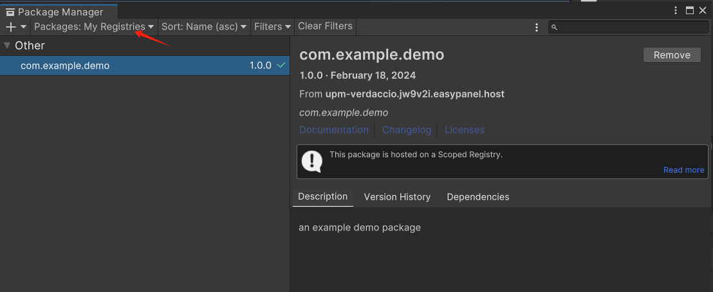


## Protect Your Registry

Now that you have a functioning private registry, it's important to ensure that not just anyone with the URL can register an account and publish packages. To safeguard your registry, you can disable the registration feature and opt to manually manage user accounts.

To achieve this, you need to modify the `config.yaml` file of Verdaccio to restrict user registration. Set `max_users` to `-1` to disable new registrations:

```yaml
auth:
  htpasswd:
    file: /verdaccio/storage/htpasswd
    # Maximum amount of users allowed to register, defaults to "+infinity".
    # You can set this to -1 to disable registration.
    max_users: -1
```

Follow these steps to update your Verdaccio configuration in EasyPanel:

- Go to EasyPanel and open the "Storage" tab for your Verdaccio service.
- Find and click the <kbd>Edit</kbd> button for the `/verdaccio/conf/config.yaml` file.
- Insert the updated configuration to disable new user registrations.
- Save your changes by clicking the <kbd>Save</kbd> button.
- Deploy the updated configuration by clicking the <kbd>Deploy</kbd> button.

With these adjustments, the registration feature on your Verdaccio registry is deactivated, safeguarding your registry against unauthorized access and use.

To manage user accounts manually, you must directly handle the `htpasswd` file and ensure it's correctly mounted to the path `/verdaccio/storage/htpasswd` within the Storage tab of EasyPanel. Utilizing the `htpasswd` command allows for efficient management of this file. Detailed instructions for using `htpasswd` exceed the scope of this guide, but ample documentation is available for those interested in exploring this method further.

## Backup Your Registry

Though enabling droplet backup is a straightforward solution, expert users can add an extra layer of data protection by regularly backing up the `/var/lib/docker/volumes` directory from their host machine to a remote storage service like S3.

## Conclusion

In conclusion, setting up your private Unity Package Manager (UPM) registry with Verdaccio on DigitalOcean, guided by EasyPanel, gives you a secure and efficient way to manage your development packages. We've walked you through how to start, create and manage a Verdaccio server, connect it to the Unity editor. This setup not only improves your team's development workflow but also keeps your packages private and protected.

Thank you for following along. With these steps, you're well-equipped to manage your packages more effectively. Happy developing!